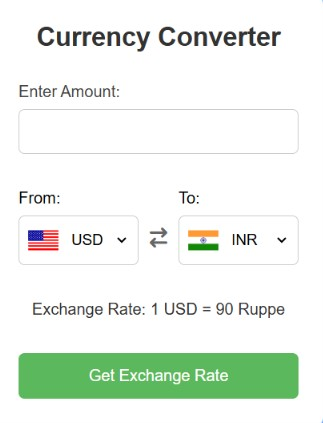

# 💱 Currency Converter

A responsive and easy-to-use **Currency Converter** built using **HTML, CSS, and JavaScript**. It fetches real-time exchange rates using a public API and allows users to quickly convert between multiple international currencies.

<p align="center">

[](https://currency-converter-five-kohl.vercel.app/)
[](https://github.com/Shravan-025/Currency-Converter)


</p>

---

## 📸 Preview

<p align="center">
  
</p>

---

## 🌐 Live Demo

🔗 **Try it here:**  
https://currency-converter-five-kohl.vercel.app/

---

## ✨ Features

- 💱 Real-time currency conversion
- 🌍 Support for multiple currencies
- 🔄 One-click currency swap
- ⚡ Live exchange rates
- 📱 Responsive design
- 🎨 Clean and modern interface
- 🛡️ Input validation

---

## 🛠️ Tech Stack

- HTML5
- CSS3
- JavaScript (ES6)
- Exchange Rate API

---

## 📂 Project Structure

```text
Currency-Converter/
│
├── assets/
│   └── preview.png
│
├── index.html
├── style.css
├── script.js
├── codes.js
└── README.md
```

---

## 🚀 Getting Started

### 1. Clone the repository

```bash
git clone https://github.com/Shravan-025/Currency-Converter.git
```

### 2. Navigate to the project

```bash
cd Currency-Converter
```

### 3. Run the application

Open `index.html` in your browser

**OR**

Use the **Live Server** extension in Visual Studio Code.

---

## 📖 How It Works

1. Enter the amount to convert.
2. Select the source currency.
3. Select the target currency.
4. Click **Get Exchange Rate**.
5. The application fetches the latest exchange rate and displays the converted amount instantly.

---

## 🚀 Future Improvements

- 🌙 Dark Mode
- ⭐ Favorite currencies
- 📊 Historical exchange rates
- 📈 Exchange rate charts
- 🔍 Search currencies
- 💾 Conversion history

---

## 🤝 Contributing

Contributions are welcome!

1. Fork the repository.
2. Create your feature branch.

```bash
git checkout -b feature-name
```

3. Commit your changes.

```bash
git commit -m "Add your feature"
```

4. Push to your branch.

```bash
git push origin feature-name
```

5. Open a Pull Request.

---

## 👨‍💻 Author

**Shravan Patel**

- GitHub: https://github.com/Shravan-025
- LinkedIn: www.linkedin.com/in/shravan-patel-b02546325

---

## ⭐ Support

If you found this project useful, please consider giving it a **⭐ Star** on GitHub.

Your support motivates me to build more open-source projects.

---
